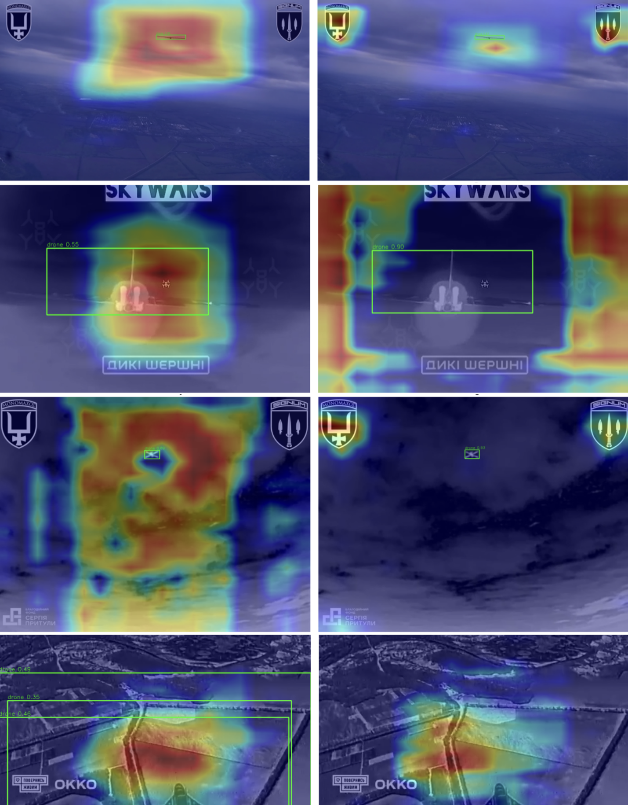

# Real-Time Embedded Drone Detection and Tracking Pipeline (YOLO26n & ByteTrack)

*Note: The source code is currently undergoing final refactoring following my bachelor's thesis defense (July 2026). The complete codebase, including TensorRT compilation scripts and custom dataset pipelines, will be made fully public shortly.*

  <video width="750" autoplay loop muted playsinline>
    <source src="docs/demo.mp4" type="video/mp4">
    Your browser does not support the video tag.
  </video>

---

## 🛠 Tech Stack
* **Frameworks & Models:** PyTorch, Ultralytics YOLO26n, Meta SAM 3, DINOv2
* **Optimization & Compilers:** NVIDIA TensorRT FP16
* **Tracking & Tools:** BoxMOT (ByteTrack, OC-SORT), OpenCV, CVAT, Hugging Face
* **APIs & Cloud:** Gemini 2.5 Pro (Vertex AI API), Kaggle (Tesla T4)

---

## 📌 Project Overview
This project presents a high-performance, real-time computer vision pipeline developed for semi-autonomous UAV interception on resource-constrained Edge AI hardware. The core challenge was to maintain a processing frequency of at least 30 FPS to compensate for the high closing speeds between the interceptor and the target, which causes rapid scale changes and loss of frame-to-frame overlap.

## 🧠 Core Architecture & Performance
* **Detection Model:** YOLO26n. Chosen for its ultra-lightweight architecture (~2.5M parameters, 5.4 GFLOPs) and the absence of an NMS module, which minimizes latency via direct coordinate output.
* **Hardware Acceleration:** Compiled into a binary **TensorRT FP16** engine.
* **Inference Speed:** Reduced raw GPU inference time to **10.45 ms (95.7 FPS)**.
* **Temporal Tracking:** Integrated **ByteTrack** using a double-association method to bridge missing frame detections and maintain ID persistence.
* **System Latency:** The end-to-end pipeline processing latency is **13.14 ms (76 FPS)**, leaving sufficient budget for flight controllers.

## 📊 Dataset Engineering & Pipeline
* **Dataset Size:** 13,200 verified frames (12,000 positive, 1,200 negative) extracted from 69,529 raw frames.
* **Challenge:** Existing public datasets (like VisDrone) suffer from incorrect "ground-to-air" perspectives and feature civil copters rather than military fixed-wing UAVs.
* **Automated Curation (Human-in-the-Loop):** 
    1. Automated metadata classification.
    2. Pseudo-annotations generated via **Meta SAM 3**.
    3. Manual expert refinement.
* **Deduplication:** Implemented a multi-stage deduplication pipeline to prevent model overfitting on near-identical adjacent frames:
    1. **Spatial deduplication:** IoU-based filtering (removed 9,796 static frames).
    2. **Semantic deduplication:** Utilizing **DINOv2** embeddings and the *k-Center Greedy* algorithm (removed 46,263 low-information frames).

### 🎯 Generalization & Shortcut Learning Mitigation
The presence of watermarks and OSD telemetry in OSINT data triggers the "Clever Hans" effect. This was solved by integrating negative samples, successfully shifting the model's EigenCAM attention maps from UI artifacts to the actual drone morphology.

  

*Comparison of EigenCAM attention maps. Left: Model trained only on positive samples (distracted by watermarks). Right: Final model trained with negative samples (focused correctly on the target).*

---

## 📈 Results

### Detection Metrics (YOLO26n)
The final model was evaluated on independent validation and test splits, demonstrating high robustness and generalization capabilities.

| Metric | Validation Split | Test Split |
| :--- | :---: | :---: |
| **Precision** | 0.9279 | 0.8886 |
| **Recall** | 0.8426 | 0.8144 |
| **mAP@50** | 0.9094 | 0.8668 |
| **mAP@50-95** | 0.7021 | 0.6696 |

### Tracking Metrics
* **ByteTrack:** HOTA = 69.26%, IDF1 = 84.14%, MOTA = 77.29%
* **OC-SORT:** HOTA = 61.38%, IDF1 = 69.11%, MOTA = 69.99%